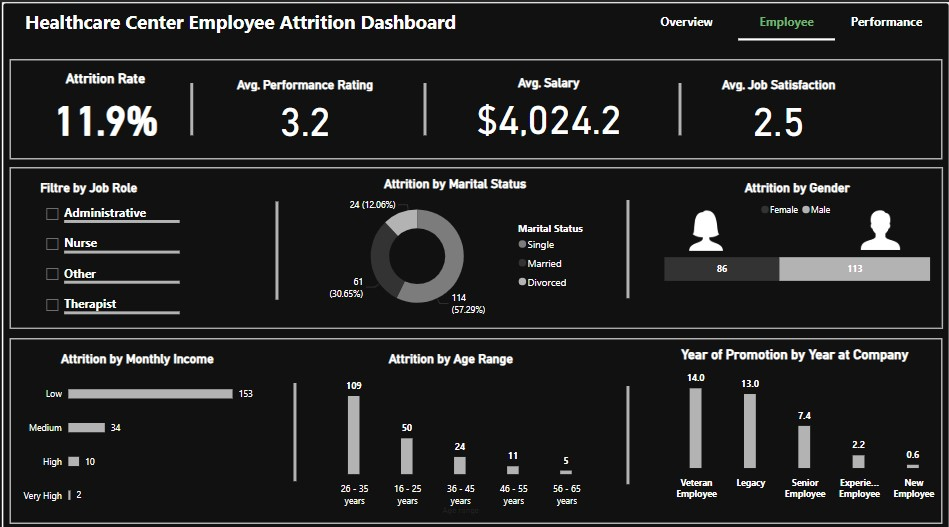
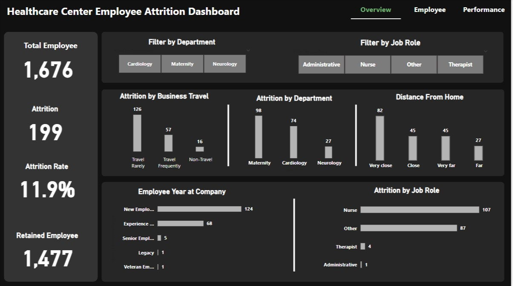
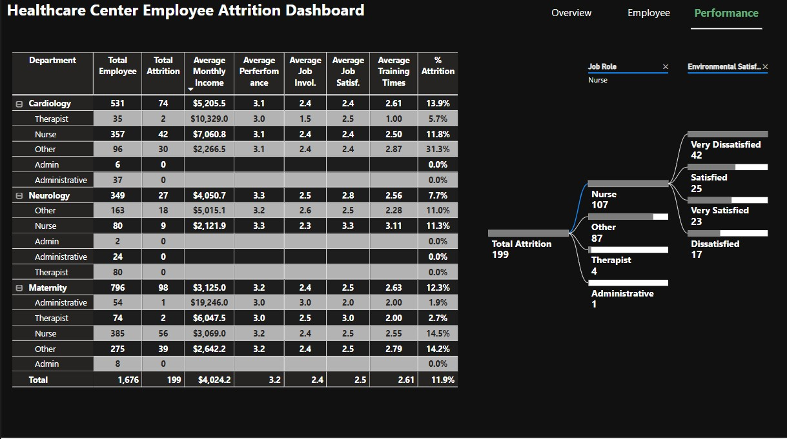
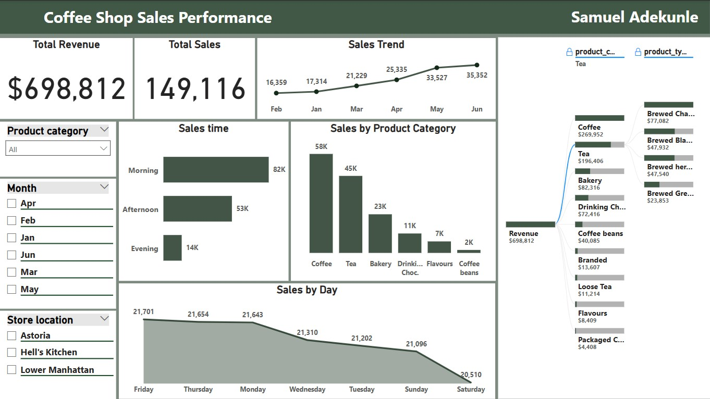

<!--Section 1: Introduce your self-->
## ABOUT ME

Hi, i'm Samuel Adekunle! A detail-oriented and analytical Data Analyst with a strong background in collecting, interpreting, and visualizing data to drive strategic business decisions. Skilled in data modeling, and visualization tools to uncover insights, improve processes, and optimize performance. Proficient in Excel, and BI tools like Tableau and Power BI.

<!--Mention your top/relevant skills here - core and soft skills-->
## Skills

*As a data analyst I transform raw data into meaningful insights by utilizing different analytical methods and tools, to assist organizations in making impactful decisions.*

**- ✅ Data Wrangling.**

**- ✅ Data Visualization.** 

**- ✅ Data Modelling .**

<!--Section 2: List 3-4 key projects-->

## MY PROJECTS 

*A glimpse of some of the projects I've been working on.*

### Project 1

**Analyse attrriton in healthcare center and also determine the factor that influence attrition rate .**

<!DOCTYPE html>
<html lang="en">
<head>
    <meta charset="UTF-8">
    <meta name="viewport" content="width=device-width, initial-scale=1.0">
    <title>Manual Navigation Slider</title>
    
</head>
<body>
    

        

            

            

            

        

        

            <button id="prev">&#10094;</button>
            <button id="next">&#10095;</button>
        

    

    
</body>
</html>

What are the key drivers of employee attrition?
[Read More](project presentation healthcare.pdf)

### Project 2

**Coffee shop sales analysis .**

Analyze sales Trends and product revenue
[Read More](coffee shop presentation.pdf)

## CONTACT DETAILS

*Let’s connect and see how we can make a difference together!*
<table>
  <tbody>
    <tr>
      <td>📧</td>
      <td><a href="mailto:adekunlesamuel701@gmail.com">adekunlesamuel701@gmail.com</a></td>
    </tr>
    <tr>
      <td>📞</td>
      <td>(234) 9037074885</td>
    </tr>
    <tr>
      <td>📍</td>
      <td>Lagos, Nigeria</td>
    </tr>
    <tr>
      <td>⬇️</td>
      <td><a href="https:SAMMY DATA RESUME.pdf">Download my CV</a></td>
    </tr>
    <tr>
      <td>🌐</td>
      <td><a href="https://www.linkedin.com/in/samuel">LinkedIn</a></td>
    </tr>
     </tbody>
</table>

   

